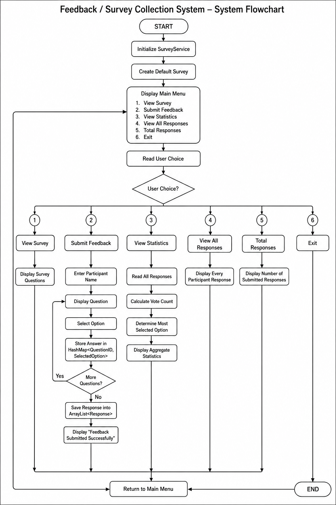

# Feedback / Survey Collection System

## Overview

The **Feedback / Survey Collection System** is a console-based Java application developed using **Object-Oriented Programming (OOP)** principles. The application allows multiple users to participate in a survey, stores their responses, and generates aggregate statistics for each question.

The project demonstrates the practical use of **ArrayList** and **HashMap** from the Java Collections Framework while following a simple **Low-Level Design (LLD)** architecture.

---

# Features

* Create and manage a survey.
* Multiple-choice questions.
* Multiple participants can submit feedback.
* Stores survey questions using **ArrayList**.
* Stores participant responses using **HashMap**.
* Displays all survey questions.
* Calculates aggregate statistics.
* Shows most selected option for every question.
* Displays all submitted responses.
* Menu-driven console application.

---

# Technologies Used

* Java
* Object-Oriented Programming (OOP)
* ArrayList
* HashMap
* Java Collections Framework

---

# Project Structure

```text
FeedbackSurveySystem
│
├── Main.java
├── SurveyService.java
├── Survey.java
├── Question.java
├── Response.java
├── Statistics.java
├── README.md
└── flowchart.jpg
```

---

# Class Responsibilities

| Class             | Responsibility                                                    |
| ----------------- | ----------------------------------------------------------------- |
| **Main**          | Entry point and menu-driven application                           |
| **SurveyService** | Handles business logic, survey management and response collection |
| **Survey**        | Stores survey title and list of questions                         |
| **Question**      | Stores question details and answer options                        |
| **Response**      | Stores participant answers using HashMap                          |
| **Statistics**    | Calculates and displays survey statistics                         |

---

# Data Structures Used

## ArrayList

Used for storing:

* Survey Questions
* Question Options
* Participant Responses

Example

```java
ArrayList<Question> questions;
ArrayList<String> options;
ArrayList<Response> responses;
```

---

## HashMap

Used for storing participant answers.

```java
HashMap<Integer, Integer> answers;
```

Example

```text
Question 1 → Option 2
Question 2 → Option 1
Question 3 → Option 4
```

---

# Project Workflow

The application follows the workflow shown below.

> **Flowchart**

```text
README.md
flowchart.jpg
```

Display in GitHub:

```markdown
## Project Flowchart


```

#  System Flowchart

<p align="center">
    
</p>
---

# Program Flow

```text
Start
   │
   ▼
Display Main Menu
   │
   ▼
Choose an Option
   │
   ├──────────────► View Survey
   │
   ├──────────────► Submit Feedback
   │                     │
   │                     ▼
   │              Save Responses
   │                     │
   │                     ▼
   ├──────────────► View Statistics
   │
   ├──────────────► View All Responses
   │
   └──────────────► Exit
```

---

# Sample Questions

### Question 1

```text
How would you rate the teaching quality?

1. Excellent
2. Good
3. Average
4. Poor
```

### Question 2

```text
Would you recommend this college?

1. Yes
2. No
```

### Question 3

```text
How would you rate the laboratory facilities?

1. Excellent
2. Good
3. Average
4. Poor
```

---

# Sample Console Output

## Main Menu

```text
==============================================
      FEEDBACK / SURVEY COLLECTION SYSTEM
==============================================

1. View Survey
2. Submit Feedback
3. View Statistics
4. View All Responses
5. Total Responses
6. Exit

Enter your choice:
```

---

## Submitting Feedback

```text
========== Submit Feedback ==========

Enter your name:
John

Question 1:
How would you rate the teaching quality?

1. Excellent
2. Good
3. Average
4. Poor

Enter your choice: 2

Question 2:
Would you recommend this college?

1. Yes
2. No

Enter your choice: 1

Question 3:
How would you rate the laboratory facilities?

1. Excellent
2. Good
3. Average
4. Poor

Enter your choice: 1

Question 4:
How satisfied are you with campus cleanliness?

1. Very Satisfied
2. Satisfied
3. Neutral
4. Dissatisfied

Enter your choice: 2

Feedback submitted successfully.
```

---

## Statistics Output

```text
==============================================
          SURVEY STATISTICS
==============================================

Question 1:
How would you rate the teaching quality?

Results:

1. Excellent -> 5 vote(s)
2. Good -> 8 vote(s)
3. Average -> 2 vote(s)
4. Poor -> 1 vote(s)

----------------------------------
Total Responses : 16
Most Selected   : Good
----------------------------------

Question 2:
Would you recommend this college?

Results:

1. Yes -> 14 vote(s)
2. No  -> 2 vote(s)

----------------------------------
Total Responses : 16
Most Selected   : Yes
----------------------------------
```

---

## View All Responses

```text
========== All Responses ==========

Respondent: John
Question 1 -> Option 2
Question 2 -> Option 1
Question 3 -> Option 1
Question 4 -> Option 2

--------------------------------

Respondent: Alice
Question 1 -> Option 1
Question 2 -> Option 1
Question 3 -> Option 2
Question 4 -> Option 1
```

---

# Object-Oriented Concepts Used

* Classes and Objects
* Encapsulation
* Constructors
* Composition
* Java Collections Framework
* Modular Design
* Low-Level Design (LLD)

---

# Learning Outcomes

After completing this project, students will understand:

* Java Object-Oriented Programming
* Practical implementation of ArrayList
* Practical implementation of HashMap
* Collection manipulation
* Console-based application development
* Basic Low-Level Design principles
* Modular code organization

---

# Future Enhancements

* Admin Login
* Dynamic Survey Creation
* Edit/Delete Questions
* File Storage
* MySQL Database Integration
* JavaFX GUI
* Online Survey Support
* Export Reports (PDF/Excel)
* Response Percentage Charts

---

# Author

**Project Title:** Feedback / Survey Collection System

**Language:** Java

**Concepts Used:** ArrayList, HashMap, OOP, Java Collections Framework

**Project Type:** Low-Level Design (LLD) Mini Project
